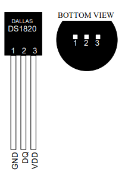

# Room Temperature Control

``WORK IN PROGRESS``

## Getting started

The following instructions will cover the prerequisites to get your copy of the project up and running on your local machine. The following steps assume, that your Raspberry Pi is already set up and ready to go. For a tutorial on a headless setup (without monitor, mouse or keyboard) you can have a look [here](headless_setup.md).

### Connecting the DS18B20 sensor to the Raspberry Pi
First, the DS18B20 needs to be connected to the Raspberry Pi.<br>
<br>
_Figure 1_ shows the pinout of the DS18B20 and _Figure 2_ shows the GPIO connector pinout of the Raspberry Pi 4 (Raspberry Pi 3 and 2 have the same pinout).<br>
<br>
<br>
_Figure 1: DS18B20 pinout. <br>(Source: [DS18B20 datasheet](data_sheets/DS18B20.pdf))_<br>
<br>
<br>
_Figure 2: Raspberry Pi 4 GPIO connector pinout. <br>(Source: [Raspberry Pi datasheet](data_sheets/RPi4.pdf))_<br>
<br>
Use the 4.7k Ohm resistor to connect the DS18B20 to the Raspberry Pi as shown in _Figure 3_, establishing the connections summarized in _Table 1_.
(The resistor is neccessary so that the Raspberry Pi can be used to supply the temperature conversion current for the sensor. See [DS18B20 datasheet](data_sheets/DS18B20), page 4.)<br>

| Function |  RPi Pin No. | DS18B20 Pin No. |
| :---: | :--- | :--- |
| data  | 7 (GPIO4) | 2 |
| Vdd   | 1 | 3 |
| GND   | 6 | 1 |
_Table 1: Pin connections in our setup._<br>
<br>
<br>
_Figure 3: Wiring setup for temperature measurement.<br>(Source: [Les Pounder: DS18B20 Temperature Sensor With Python (Raspberry Pi)](https://bigl.es/ds18b20-temperature-sensor-with-python-raspberry-pi/))_

### Enabling the Raspberry Pi's 1-Wire communication interface
The DS18B20 sensor uses [1-Wire communication](https://en.wikipedia.org/wiki/1-Wire) to transmit its data. The Raspberry Pi's GPIO4 can be configured as a 1-Wire bus interface so the Raspberry Pi will be able to communicate with the DS18B20. To enable the 1-Wire functionality on the Raspberry Pi, you can choose one of the following methods:

#### Method 1: Via GUI
This method is used, if your Pi boots to the desktop.

* On your Raspberry Pi start the _Raspberry Pi Configuration Tool_ by clicking _Menu_ -> _Preferences_ -> _Raspberry Pi Configuration_.
* In the _Interfaces_ tab set _1-Wire_ to _Enabled_ and confirm by clicking _Ok_.
* When prompted to reboot, select _Yes_ (so that the changes will take effect) and wait until the Raspberry Pi has rebooted.

#### Method 2: Via terminal
This method is used, if you are running your Raspberry Pi headless or if you are more comfortable using the terminal than the GUI.

* On your Raspberry Pi open a terminal session and start the _Raspberry Pi Configuration Tool_ with
    ```Bash
    sudo raspi-config
    ```
* Select _5 Interfacing Options_ -> _P7 1-Wire_ -> _Yes_ -> _Ok_.
* When prompted to reboot, select _Yes_ (so that the changes will take effect) and wait until the Raspberry Pi has rebooted.

## Author

**Elisabeth Strunk**<br>
 https://github.com/ElisabethStrunk<br>
 https://www.linkedin.com/in/elisabeth-strunk/<br>
<br>

## License
This project is licensed under the MIT License - see the [LICENSE.txt](LICENSE.txt) file for details.

## Acknowledgments

* Huge thanks to [Les Pounder](https://bigl.es/author/les/) who authored an [article](https://bigl.es/ds18b20-temperature-sensor-with-python-raspberry-pi/) on how to use DS18B20 sensors with Rasperry Pi.
* Huge thanks to Scott Campbell from [Circuit Basics](http://www.circuitbasics.com/) who authored an [article](http://www.circuitbasics.com/raspberry-pi-ds18b20-temperature-sensor-tutorial/) on how to use DS18B20 sensors with Rasperry Pi.
* Huge thanks to Matt Hawkins from [Raspberry Pi Spy](https://www.raspberrypi-spy.co.uk/) who authored an [article](https://www.raspberrypi-spy.co.uk/2018/02/enable-1-wire-interface-raspberry-pi/) on how to enable 1-Wire on Rasperry Pi.
